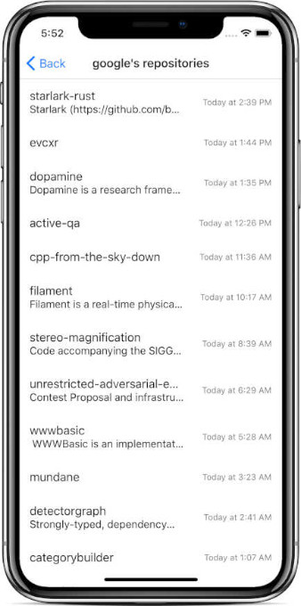

# RN GitHub Users

An example project implemented in **React Native**.
It uses mostly: **redux**, **lottie**, **mocha**, **detox**, **GraphQL** and other...

In the app you can look for GitHub users and list their repositories.
Informations are presented in two screens.

# Examples

## Animations

## Users screen

## Repos screen

# Before you start

* Install packages by `npm install`.
* App uses [GitHub GraphQL API](https://developer.github.com/v4/ "GitHub GraphQL API"). Use the following steps to get access to it: 
 * generate a token at <https://github.com/settings/tokens>,
 * make a new file `token.js` with the contents of `default.token.js`,
 * insert your token inside the new `token.js` file.
* App is ready to start! 🎉

# What is missing

 - persistent storage usage,
 - **Flow** or **TypeScript** usage,
 - pagination of query results,

# Packages used

Package  | Description
-------------: | :-------------
[sort-by-chain](http://npmjs.com/package/sort-by-chain) | simple package for sorting, created by me
[redux](https://redux.js.org) | predictable state container
[lottie](https://airbnb.design/lottie/) | animations for presenting empty list, loading and error
[react-apollo](https://github.com/apollographql/react-apollo) | GraphQL client library for React
[lodash](https://lodash.com) | library with lots of tools, from which I used `debounce` for data fetching
[moment](https://momentjs.com) | js tool for dates and times
[react-navigation](https://reactnavigation.org) | in-app routing and navigation
[react-native-elements](https://react-native-training.github.io/react-native-elements/) | UI components (`SearchBar`, `ListItem`)
[moment](https://momentjs.com) | js tool for dates and times
[mocha](https://mochajs.org) | unit test framework
[detox](https://github.com/wix/Detox) | gray-box UI test and automation framework
[eslint](https://eslint.org) | linter with ES6 and JSX support
[babel](https://babeljs.io) | ES6 transpiler

# License

Copyright 2018 Szymon Koper

Licensed under the Apache License, Version 2.0 (the "License");
you may not use this file except in compliance with the License.
You may obtain a copy of the License at

    http://www.apache.org/licenses/LICENSE-2.0

Unless required by applicable law or agreed to in writing, software
distributed under the License is distributed on an "AS IS" BASIS,
WITHOUT WARRANTIES OR CONDITIONS OF ANY KIND, either express or implied.
See the License for the specific language governing permissions and
limitations under the License.

